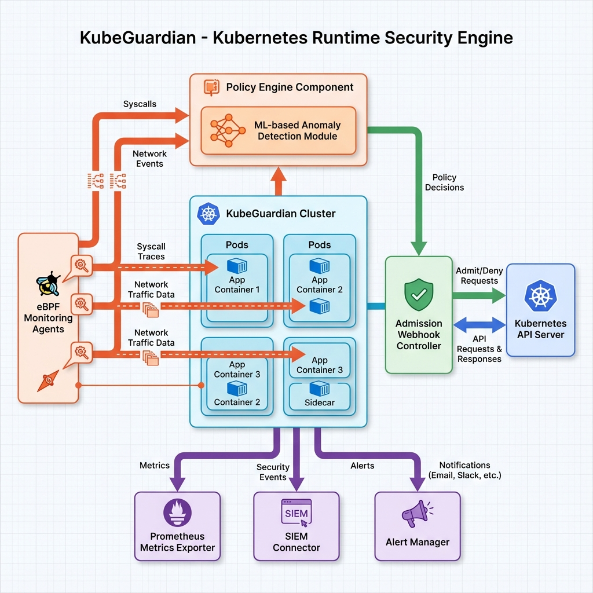

# KubeGuardian-Core

[](https://opensource.org/licenses/MIT)
[](https://kubernetes.io/)
[](https://golang.org/)

**Runtime-движок безопасности для Kubernetes**

🛡️ Мониторинг на основе eBPF • 🤖 ML-детектирование аномалий • 🚫 Применение политик • 📊 Интеграция с SIEM

---

## 🏢 О проекте

**KubeGuardian** — это runtime-движок безопасности, обеспечивающий непрерывный мониторинг и защиту от угроз рабочих нагрузок Kubernetes. Используя eBPF (Extended Berkeley Packet Filter) для наблюдаемости на уровне ядра, машинное обучение для поведенческого анализа и Kubernetes admission webhooks для применения политик, KubeGuardian обеспечивает комплексную безопасность без влияния на производительность приложений.

**Автор**: [@ranas-mukminov](https://github.com/ranas-mukminov)  
**Сайт**: [run-as-daemon.ru](https://run-as-daemon.ru)  
**Language**: [English version](README.md)

> **Примечание**: Это демонстрационный репозиторий, показывающий архитектуру и концепцию. Enterprise-версия с полной eBPF-инструментацией, production ML-моделями и круглосуточной поддержкой доступна в рамках услуг по аудиту безопасности.

---

## ✨ Ключевые возможности

### 🔍 Runtime-мониторинг
- **Трассировка syscall на основе eBPF** с задержкой менее микросекунды
- **Мониторинг сетевой активности**: TCP/UDP-соединения, DNS-запросы
- **Отслеживание доступа к файлам**: операции чтения/записи, изменение прав
- **Мониторинг запуска процессов**: полный захват командной строки и окружения
- **Zero-copy сбор данных** для минимальных накладных расходов

### 🧠 Интеллектуальное обнаружение угроз
- **Обнаружение аномалий на основе ML**: изучение нормальных паттернов поведения для каждого pod/namespace
- **Поведенческое профилирование**: статистические и нейросетевые модели
- **Многофакторная оценка рисков**: агрегированная оценка угроз
- **Интеграция Threat Intelligence**: проверка репутации IP/доменов
- **Адаптивные политики**: динамическая настройка правил на основе наблюдаемых паттернов

### 🚫 Применение политик
- **Kubernetes admission webhooks**: валидация подов перед развертыванием
- **Блокировка в реальном времени**: предотвращение вредоносных действий at runtime
- **Автоматическое усиление защиты**: мутация спецификаций подов согласно best practices
- **Политики соответствия**: CIS Benchmarks, PCI-DSS, пользовательские правила
- **Аудит-логирование**: полная цепочка для форензики

### 📊 Наблюдаемость и интеграция
- **Метрики Prometheus**: экспорт метрик производительности и безопасности
- **Трассировка OpenTelemetry**: отслеживание распределенных запросов
- **Интеграция с SIEM**: Elasticsearch, Splunk, Loki
- **Маршрутизация алертов**: PagerDuty, Slack, email, webhooks
- **Пользовательские дашборды**: шаблоны для визуализации в Grafana

---

## 🏗️ Архитектура



### Компоненты

1. **eBPF Agent** (DaemonSet)
   - Развертывается на каждой ноде Kubernetes
   - Собирает события на уровне ядра с помощью eBPF/CO-RE
   - Агрегирует и пересылает в Policy Engine

2. **Policy Engine** (Deployment)
   - Обрабатывает события от всех агентов
   - Запускает ML-модели для обнаружения аномалий
   - Оценивает политики безопасности
   - Экспортирует метрики и алерты

3. **Admission Webhook** (Deployment)
   - Валидирует создание/обновление подов
   - Применяет ограничения безопасности
   - Предотвращает развертывание несоответствующих рабочих нагрузок

**📖 Подробная документация**: [ARCHITECTURE.md](ARCHITECTURE.md)

---

## 🚀 Быстрый старт

### Требования

- Кластер Kubernetes 1.24+
- `kubectl` с правами cluster admin
- Helm 3.0+ (опционально, для упрощенного развертывания)

### Установка

#### 1. Создание namespace
```bash
kubectl create namespace kubeguardian-system
```

#### 2. Развертывание RBAC-ресурсов
```bash
kubectl apply -f deployments/kubernetes/rbac.yaml
```

#### 3. Развертывание агента
```bash
kubectl apply -f deployments/kubernetes/daemonset.yaml
```

#### 4. Развертывание admission webhook
```bash
# Генерация TLS-сертификатов (требуется cert-manager или ручное создание)
# См. docs/certificates.md для деталей

kubectl apply -f deployments/kubernetes/webhook.yaml
```

#### 5. Проверка развертывания
```bash
kubectl -n kubeguardian-system get pods
```

Ожидаемый вывод:
```
NAME                                    READY   STATUS    RESTARTS   AGE
kubeguardian-agent-xxxxx                1/1     Running   0          1m
kubeguardian-webhook-xxxxxxxxxx-xxxxx   1/1     Running   0          1m
```

### Конфигурация

Редактирование политик через ConfigMaps или CRD (Custom Resource Definitions):

```yaml
apiVersion: v1
kind: ConfigMap
metadata:
  name: kubeguardian-policies
  namespace: kubeguardian-system
data:
  policies.yaml: |
    policies:
    - name: block-privilege-escalation
      description: Предотвращение получения дополнительных привилегий контейнерами
      conditions:
      - field: securityContext.allowPrivilegeEscalation
        operator: equals
        value: true
      action: deny
```

---

## 📋 Сценарии использования

### 🎯 Runtime-обнаружение угроз
Обнаружение и блокировка:
- Криптомайнеры
- Reverse shells и C2-соединения
- Попытки кражи credentials
- Lateral movement
- Попытки побега из контейнера

### 🔒 Обеспечение соответствия
Автоматическая валидация согласно:
- CIS Kubernetes Benchmarks
- Требованиям PCI-DSS для контейнеров
- Пользовательским организационным политикам
- Отраслевым регуляциям (HIPAA, GDPR, 152-ФЗ и др.)

### 🏢 Zero Trust безопасность
- Непрерывная верификация всех рабочих нагрузок
- Применение принципа наименьших привилегий
- Валидация сегментации сети
- Проверки неизменяемости инфраструктуры

### 📈 Security Operations
- Централизованная агрегация событий безопасности
- Поддержка форензических расследований
- Автоматизация реагирования на инциденты
- Дашборды состояния безопасности

---

## 🛠️ Технологический стек

| Компонент | Технология |
|-----------|-----------|
| **Основной язык** | Go 1.21+ |
| **Инструментация ядра** | eBPF, libbpf, CO-RE |
| **Машинное обучение** | TensorFlow Lite, ONNX Runtime |
| **Интеграция с Kubernetes** | client-go, admission webhooks, CRD |
| **Наблюдаемость** | Prometheus, OpenTelemetry |
| **Хранение событий** | Elasticsearch, Loki |

---

## 📊 Производительность

| Метрика | Значение |
|--------|-------|
| **Накладные расходы CPU агента** | <2% на ядро |
| **Память агента** | ~100MB на ноду |
| **Влияние на задержку syscall** | <1μs |
| **Задержка оценки политик** | <10ms (p99) |
| **Задержка webhook admission** | <50ms (p99) |
| **Пропускная способность событий** | >10,000 событий/сек на контроллер |

Протестировано на: GKE, EKS, AKS, bare-metal Kubernetes

---

## 🔐 Соображения безопасности

- **Минимальные привилегии**: агенты работают только с необходимыми capabilities (`CAP_SYS_ADMIN` для eBPF)
- **mTLS-коммуникация**: весь трафик между компонентами шифруется
- **Нет хранения чувствительных данных**: события обрабатываются in-memory, экспорт шифруется
- **Интеграция с RBAC**: нативное управление доступом Kubernetes
- **Аудит-логирование**: полная цепочка всех решений по безопасности

---

## 🤝 Участие в разработке

Приветствуются вклады в документацию и обсуждения архитектуры!

См. [CONTRIBUTING.md](CONTRIBUTING.md) для руководства.

**Примечание**: Основная реализация является проприетарной. Данный репозиторий содержит концептуальные демонстрации и интерфейсы.

---

## 📜 Лицензия

Лицензия MIT - см. файл [LICENSE](LICENSE).

**Примечание**: Enterprise-версия доступна по коммерческой лицензии.

---

## 💼 Коммерческая поддержка

Данный демо-репозиторий демонстрирует архитектуру KubeGuardian. **Enterprise-версия** включает:

✅ Полную eBPF-инструментацию с поддержкой CO-RE  
✅ Production-готовые ML-модели  
✅ Круглосуточную поддержку с SLA  
✅ Разработку пользовательских политик  
✅ Сертификаты соответствия  
✅ Управление мультикластерами  
✅ Продвинутый threat intelligence  

### Доступные услуги

🔍 **Аудит безопасности**
- Оценка инфраструктуры Kubernetes
- Сканирование и устранение уязвимостей
- Оценка состояния безопасности
- Анализ разрывов по compliance

⚙️ **Интеграция DevSecOps**
- Безопасность CI/CD-конвейеров
- Сканирование Infrastructure as Code
- Управление секретами
- Автоматизированные проверки соответствия

🛡️ **Мониторинг и реагирование на инциденты**
- Интеграция и настройка SIEM
- Мониторинг угроз в реальном времени
- Планирование реагирования на инциденты
- Поддержка форензического анализа

📞 **Контакты**: [https://run-as-daemon.ru](https://run-as-daemon.ru)  
👤 **GitHub**: [@ranas-mukminov](https://github.com/ranas-mukminov)

---

## 📚 Документация

- [Обзор архитектуры](ARCHITECTURE.md)
- [Руководство по установке](docs/installation.md) _(скоро)_
- [Конфигурация политик](docs/policies.md) _(скоро)_
- [Устранение неполадок](docs/troubleshooting.md) _(скоро)_
- [Справочник API](docs/api.md) _(скоро)_

---

## 🗺️ Дорожная карта

- [x] Базовая архитектура и концепция
- [x] Интерфейсы eBPF-агента
- [x] Проектирование Policy Engine
- [ ] Поддержка Windows-контейнеров
- [ ] Интеграция с service mesh (Istio, Linkerd)
- [ ] AI-генерация политик
- [ ] Автоматизация compliance-отчетности
- [ ] Автоматизация мультиоблачного развертывания

---

## 🌟 Связанные проекты

- **CloudGuardian** - AI-аудитор облачной инфраструктуры
- **AutoHarden-Toolkit** - Автоматизированное усиление защиты серверов на основе CIS Benchmarks

Больше на: [https://github.com/ranas-mukminov](https://github.com/ranas-mukminov)

---

<p align="center">
  <strong>Создано с ❤️ для безопасности Kubernetes</strong><br>
  <a href="https://run-as-daemon.ru">run-as-daemon.ru</a> • 
  <a href="https://github.com/ranas-mukminov">@ranas-mukminov</a>
</p>
